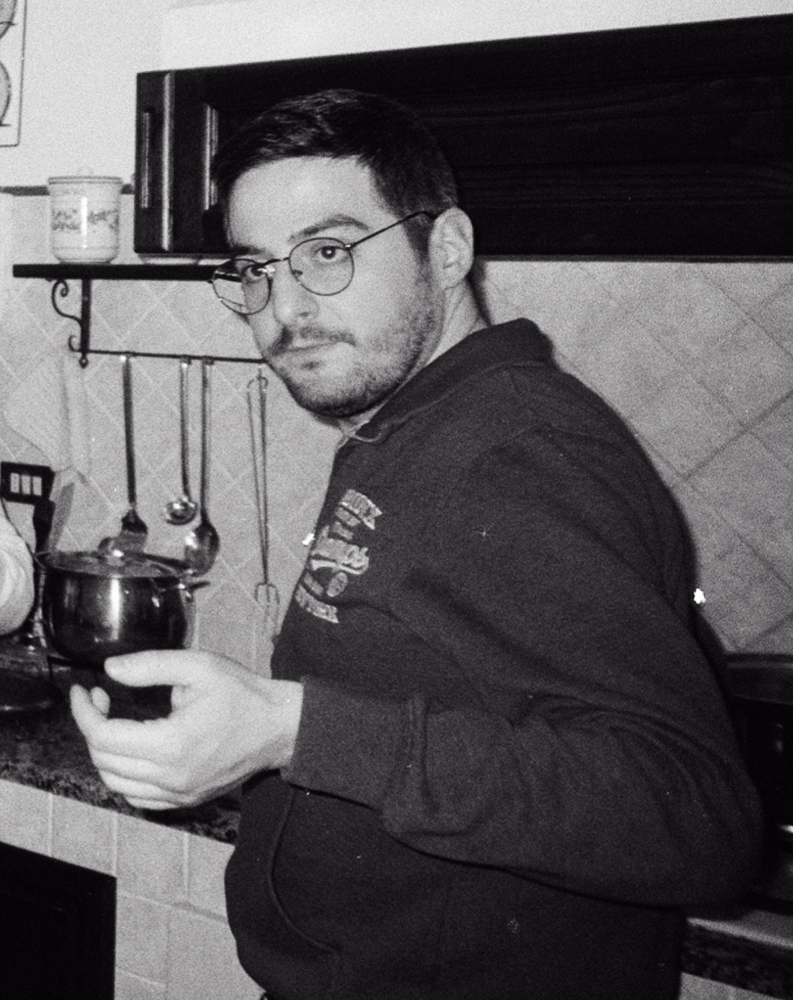

# Gabriele

🇮🇹 

Il 1994 non poteva donarci esemplare migliore.

Re delle polemiche, non si risparmierà a ricordarti cosa hai detto 5 anni prima, quella sera di luglio, pur di avere ragione.

I gin premium del Carrefour non sono mai al sicuro se è giorno di smartworking, qualcuno saprà quando inizia e finisce l'offerta dedicata. Se non è essere smart questo.

Raccomandazione nell'averci a che fare: non riempirgli la macchina di brillantini.

🇬🇧 

1994 couldn't have given us a better specimen.

The king of controversy, he won't hesitate to remind you of what you said five years earlier, on that July evening, just to prove himself right.

Carrefour’s premium gins are never safe on a work-from-home day, also known as smartworking in Italy; someone will know exactly when the special offer starts and ends. If that isn’t being smart, I don’t know what is.

A word of advice when dealing with him: don’t fill his car with glitter.

🇪🇸

El año 1994 no podría habernos dado un ejemplo mejor.

Rey de la polémica, no dudará en recordarte lo que dijiste cinco años antes, aquella noche de julio, con tal de tener razón.

Los ginebras premium del Carrefour nunca están a salvo si es día de teletrabajo; alguien sabrá cuándo empieza y termina la oferta especial. Si eso no es ser inteligente, ¿qué lo es?

Recomendación para tratar con él: no le llenes el coche de purpurina.

[Tolo](tolo)

[Home](index)
