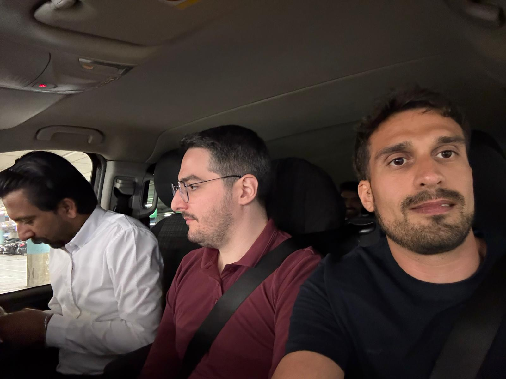
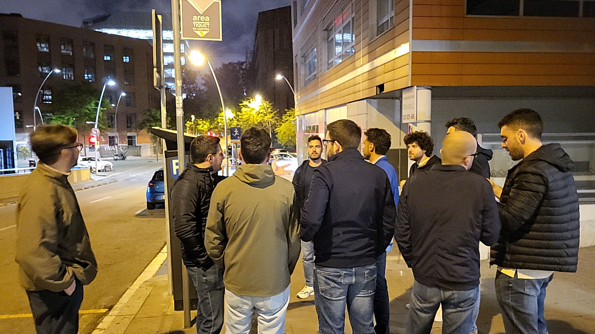
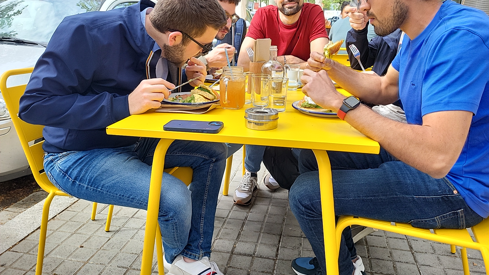
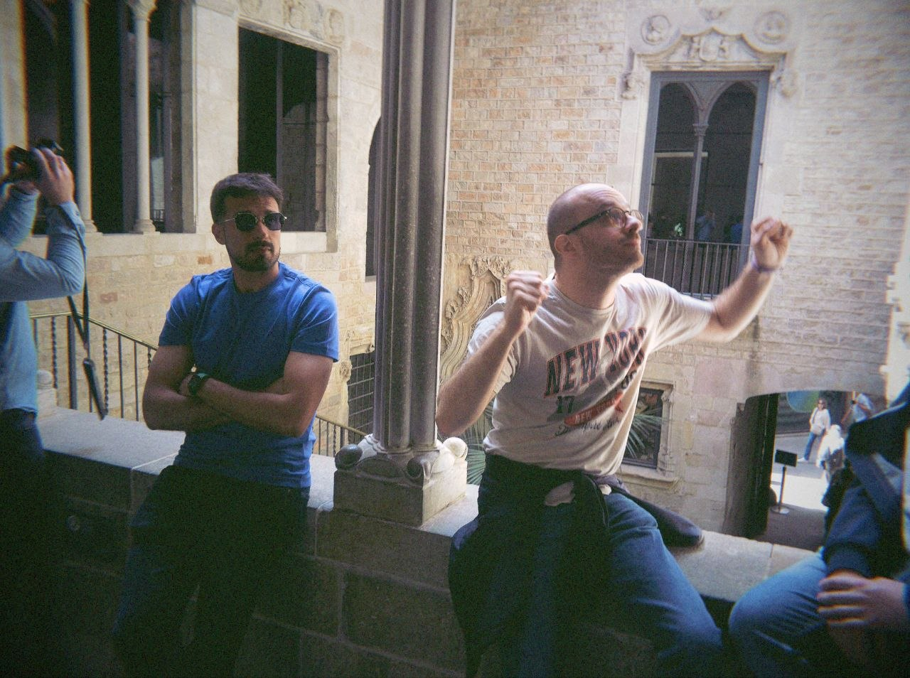
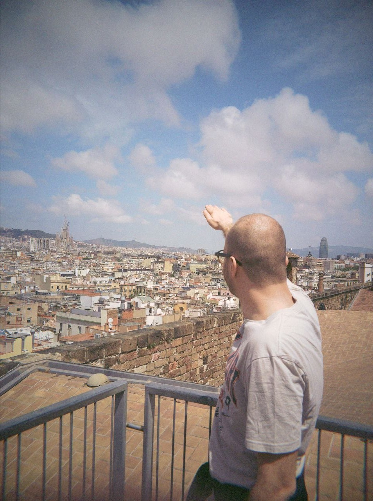
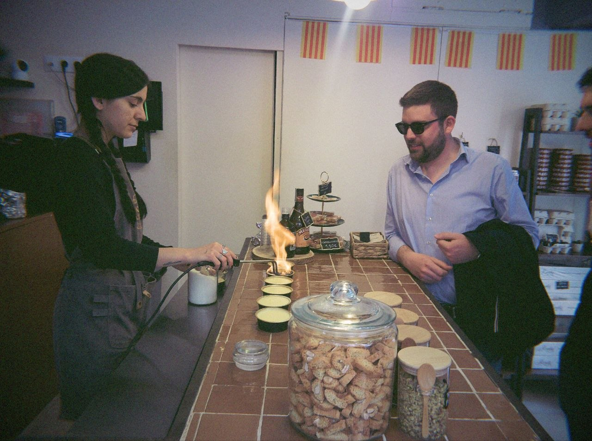
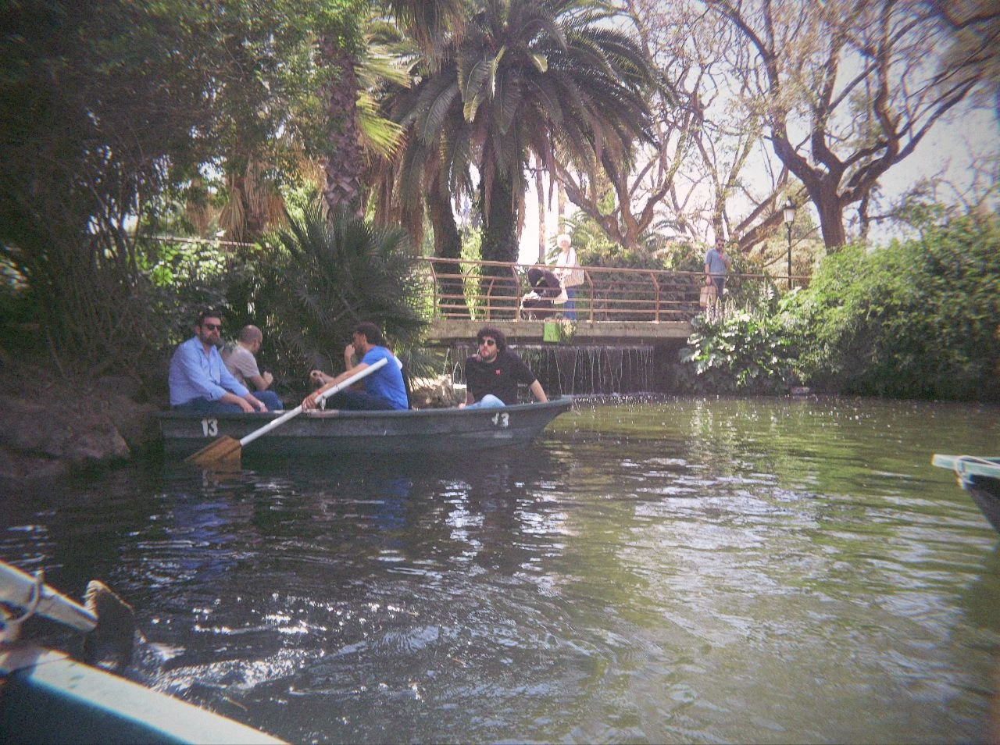
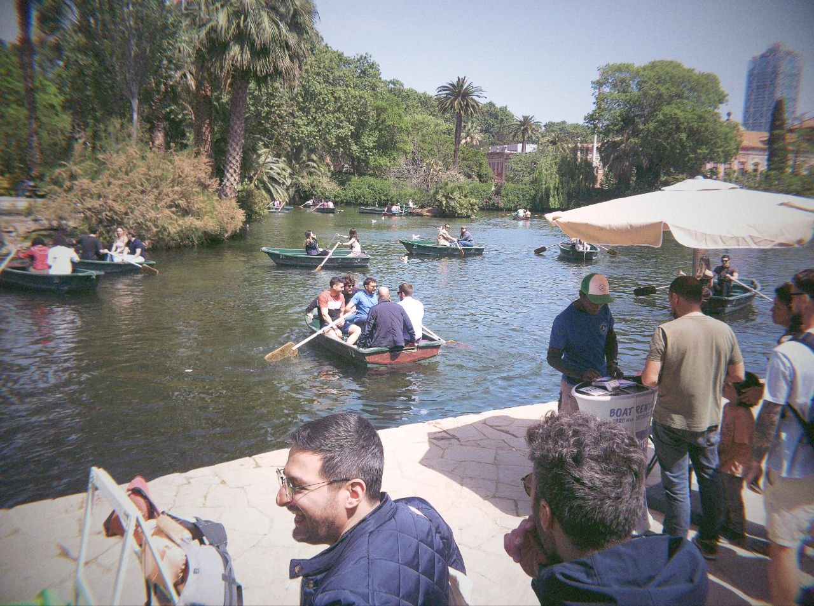
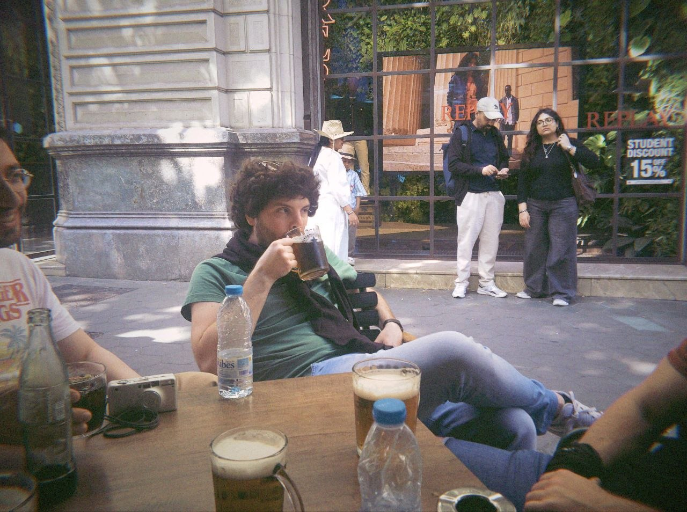
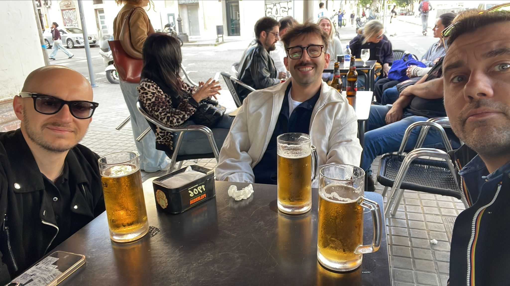

# Benvenuti alla favolosa avventura del Bartellini 

Una squadra eterogenea quella che accompagna i futuri sposi, il più sereno è un orso. 

Qui potete trovare una descrizione dei protagonisti:

* [Gabri](gabri)
* [Tolo](tolo)

## Giorno 1 (29/4) - L'arrivo

 

Il primo gruppo del Bartellini proveniente da vari parti d'Italia è arrivato nella spumosa Barcellona grazie agli intrepidi indiani di Bolt. 

Dopo una paella accompagnata dalla compagnia di un eterometabole, la Barceloneta e i suoi locali etnici hanno accompagnato il resto della serata. 

## Giorno 2 (30/4) - Il lago del chill

La mattina comincia con una colazione rinforzata del team salato e due piccole colazioni del team dolce. In figura una testimonianza del primo team. 

 

Una gita in centro ha condotto l'interno gruppo all'interno del museo Gaudì (sic), un toccasana per l'anima artistica dei partecipanti. 

L'immagine seguente testimonia il risveglio emotivo di un paio di membri. 

Non paghi di arte, gli eroici Bartellini si inerpicano sulle terrazze della chiesa di Santa Maria del Mar il cui stile gotico ha risvegliato nostalgie un po' fuori luogo. 

L'altezza ha prodotto un certo appetito che è stato spento da tapas e bollicine. 

Il salato ha chiamato qualcosa di dolce e la crema catalana di Ingrid ha risposto. 

Sazi e satolli, è stato il momento dell'avventura piratesca con esiti un po' misti.

La lontanza dalla cultura si è fatta sentire ancora una volta ma non tutti hanno orecchie sensibili. 

Il resto del team Bartellini nel frattempo si è aggiunto all'avventura, calandosi perfettamente nella parte. 

 

I metallari dei Bartellini, per la gioia di Tolo, sono riusciti a completare una side quest prima di riunirsi al gruppo per cena (foto non ancora disponibili). 

Il resto della serata è confidenziale. 

## Giorno 3 (1/5)

In corso. 

## Giorno 4 (2/5)

In arrivo. 

## Giorno 5 (3/5)

In arrivo. 