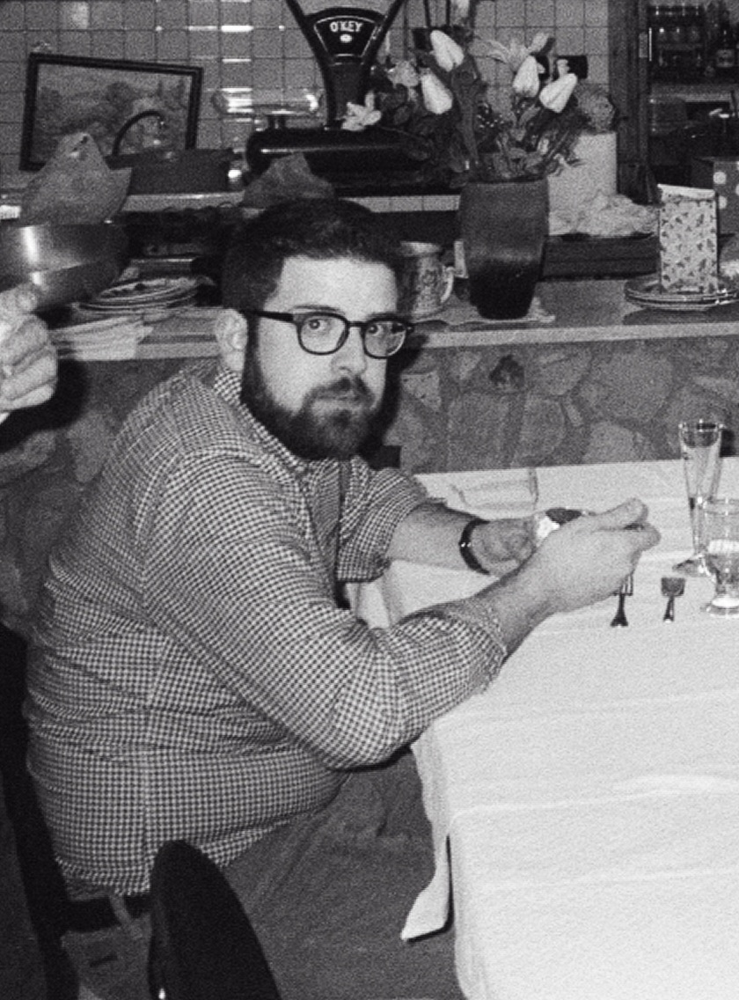

# Bartolomeo

🇮🇹 

Sei un cinghiale, un pesce d'acqua dolce o un filetto di manzo? Dì le tue preghiere.

Potrebbe essere un po' burbero al primo incontro ma non c'è da preoccuparsi: continuerà ad esserlo anche nei successivi.

Progettista di ponti, case, mostre di farfalle e presepi, se hai bisogno di una CILA sai a chi rivolgerti. 

Consiglio per l'approccio: suonargli il repertorio di Sanremo e Canzonissima dal 1951 a oggi. 

🇬🇧 

Are you a wild boar, a freshwater fish, or a beef tenderloin? Say your prayers.

He might seem a bit gruff at first, but don’t worry: he’ll stay that way in future encounters too.

Designer of bridges, houses, butterfly exhibits, and nativity scenes—if you need a CILA, you know who to turn to.

Tip for approaching him: play him the Sanremo and Canzonissima repertoire from 1951 to the present. 

🇪🇸 

¿Eres un jabalí, un pez de agua dulce o un filete de ternera? Reza tus oraciones.

Puede que sea un poco brusco en el primer encuentro, pero no te preocupes: seguirá siéndolo en los siguientes.

Diseñador de puentes, casas, exposiciones de mariposas y belenes; si necesitas una CILA, ya sabes a quién acudir.

Consejo para entablar conversación: ponle el repertorio de Sanremo y Canzonissima desde 1951 hasta hoy. 

[Gabri](gabri)

[Home](index)
